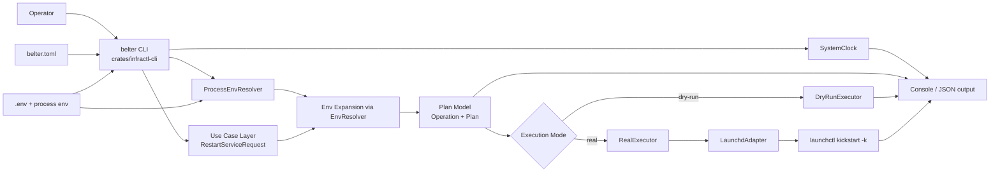

# Architecture - btc-infra-tools (Current Implementation)

This document describes the current architecture implemented in `btc-infra-tools` and how command execution flows across crates.

## System Diagram

## Components

### `crates/infractl-cli`
- Entry point (`belter` binary), command parsing (`clap`) and command routing.
- Loads `.env` from current working directory when present.
- Reads and parses `belter.toml`.
- Composes runtime dependencies such as `SystemClock` and `ProcessEnvResolver`.
- Builds a use case request, gets a plan, selects executor (`dry-run` or real), and emits human/JSON output.

### `crates/infractl-core`
- Domain and application logic, independent from OS process execution.
- Key modules:
  - `config`: typed config model (`BelterConfig`, services, checks, actions).
  - `usecase`: business workflow (`RestartServiceRequest`) that validates input and creates an execution plan.
  - `env`: `EnvResolver` port plus placeholder expansion in config-driven fields (`${VAR}`, `${VAR:-default}`, escaped `\${...}`).
  - `plan`: plan representation (`Plan`, `Operation`) and executor contract (`Executor` trait).
  - `time`: `Clock` port and concrete clock implementations.
  - `output`: envelope model for consistent command output.

### `crates/infractl-adapters`
- Infrastructure-side execution of core operations.
- `RealExecutor` interprets `Plan` operations and delegates system actions.
- `DryRunExecutor` validates the dry-run path without touching the system.
- `LaunchdAdapter` encapsulates `launchctl` invocation and maps known errors to actionable messages.

## Runtime Flow (Service Restart)

1. Operator runs `belter service restart <name> [--dry-run]`.
2. CLI loads `.env` (if present) and `belter.toml`.
3. `RestartServiceRequest` validates service config and builds a `Plan`.
4. Service `unit` placeholders are expanded via `EnvResolver`.
5. CLI selects executor:
   - `DryRunExecutor`: executes the dry-run path without mutating the system.
   - `RealExecutor`: dispatches operation to platform adapter.
6. Adapter invokes underlying manager command (currently `launchctl` for supported manager values).
7. CLI prints structured result.
   - Human mode: summary plus dry-run event lines and plan payload when relevant.
   - JSON mode: a single envelope with `data` and `events`.

## Design Notes

- The core produces manager-agnostic operations (`manager` + `unit`), while adapter support is implemented incrementally.
- Dry-run is first-class: same plan, different executor.
- The core depends on explicit ports (`Clock`, `EnvResolver`) rather than global process state.
- Configuration and environment resolution happen before execution, so runtime commands receive concrete values.
- Output formatting is owned by the CLI envelope layer; auxiliary messages travel as structured `events`.
- Error handling is contextual (`anyhow` + adapter-specific messages) to aid operator troubleshooting.
