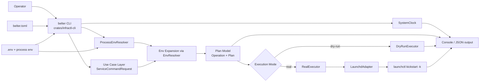
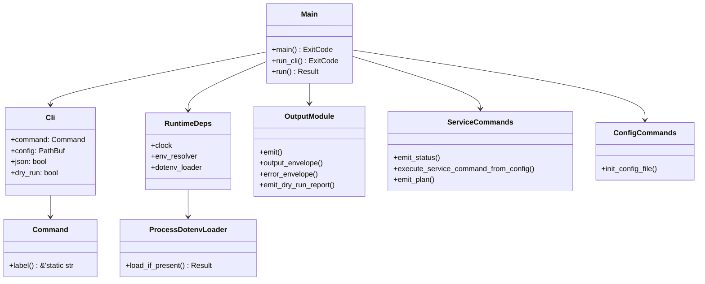
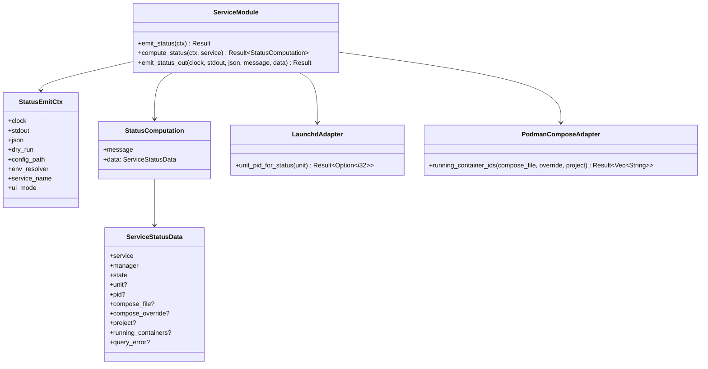

# Architecture - btc-infra-tools (Current Implementation)

This document describes the current architecture implemented in `btc-infra-tools` and how command execution flows across crates.

## System Diagram

```mermaid
flowchart LR
  U[Operator] --> CLI[belter CLI\ncrates/infractl-cli]
  CFG[belter.toml] --> CLI
  ENV[.env + process env] --> CLI

  CLI --> UC[Use Case Layer\nServiceCommandRequest]
  CLI --> ENVRES[ProcessEnvResolver]
  CLI --> CLK[SystemClock]
  ENV --> ENVRES
  CLK --> OUT
  ENVRES --> ENVEXP
  UC --> ENVEXP[Env Expansion via EnvResolver]
  ENVEXP --> PLAN[Plan Model\nOperation + Plan]
  PLAN --> OUT

  PLAN --> EXESEL{Execution Mode}
  EXESEL -->|dry-run| DREX[DryRunExecutor]
  EXESEL -->|real| REX[RealExecutor]

  DREX --> OUT[Console / JSON output]
  REX --> LAD[LaunchdAdapter]
  LAD --> LCTL[launchctl kickstart -k]
  LCTL --> OUT
```

## CLI Internal Class Diagrams

### `crates/infractl-cli` module layout

```mermaid
classDiagram
  class Main {
    +main() ExitCode
    +run_cli() ExitCode
    +run() Result
  }

  class Cli {
    +command: Command
    +config: PathBuf
    +json: bool
    +dry_run: bool
  }

  class Command {
    +label() &'static str
  }

  class RuntimeDeps {
    +clock
    +env_resolver
    +dotenv_loader
  }

  class ProcessDotenvLoader {
    +load_if_present() Result
  }

  class OutputModule {
    +emit()
    +output_envelope()
    +error_envelope()
    +emit_dry_run_report()
  }

  class ServiceCommands {
    +emit_status()
    +execute_service_command_from_config()
    +emit_plan()
  }

  class ConfigCommands {
    +init_config_file()
  }

  Main --> Cli
  Main --> RuntimeDeps
  Main --> OutputModule
  Main --> ServiceCommands
  Main --> ConfigCommands
  RuntimeDeps --> ProcessDotenvLoader
  Cli --> Command
```

### `service status` computation and rendering split

```mermaid
classDiagram
  class StatusEmitCtx {
    +clock
    +stdout
    +json
    +dry_run
    +config_path
    +env_resolver
    +service_name
    +ui_mode
  }

  class ServiceStatusData {
    +service
    +manager
    +state
    +unit?
    +pid?
    +compose_file?
    +compose_override?
    +project?
    +running_containers?
    +query_error?
  }

  class StatusComputation {
    +message
    +data: ServiceStatusData
  }

  class ServiceModule {
    +emit_status(ctx) Result
    +compute_status(ctx, service) Result~StatusComputation~
    +emit_status_out(clock, stdout, json, message, data) Result
  }

  class LaunchdAdapter {
    +unit_pid_for_status(unit) Result~Option~i32~~
  }

  class PodmanComposeAdapter {
    +running_container_ids(compose_file, override, project) Result~Vec~String~~
  }

  ServiceModule --> StatusEmitCtx
  ServiceModule --> StatusComputation
  StatusComputation --> ServiceStatusData
  ServiceModule --> LaunchdAdapter
  ServiceModule --> PodmanComposeAdapter
```

## Components

### `crates/infractl-cli`
- Entry point (`belter` binary), command parsing (`clap`) and command routing.
- Loads `.env` from current working directory when present.
- Reads and parses `belter.toml`.
- Composes runtime dependencies such as `SystemClock` and `ProcessEnvResolver`.
- Builds `ServiceCommandRequest`, gets a plan, selects executor (`dry-run` or real), and emits human/JSON output.
- Service status now supports:
  - `launchd` via `launchctl print` (`running|stopped|unknown`, optional `pid`).
  - `podman_compose` via `podman compose ... ps -q` (`running|stopped|unknown`, container list in `running_containers`).

### `crates/infractl-core`
- Domain and application logic, independent from OS process execution.
- Key modules:
  - `config`: typed config model (`BelterConfig`, services, checks, actions).
  - `usecase`: business workflow (`RestartServiceRequest`) that validates input and creates an execution plan.
    - Current concrete entry point used by CLI service actions: `ServiceCommandRequest`.
  - `env`: `EnvResolver` port plus placeholder expansion in config-driven fields (`${VAR}`, `${VAR:-default}`, escaped `\${...}`).
  - `plan`: plan representation (`Plan`, `Operation`) and executor contract (`Executor` trait).
  - `time`: `Clock` port and concrete clock implementations.
  - `output`: envelope model for consistent command output.

### `crates/infractl-adapters`
- Infrastructure-side execution of core operations.
- `RealExecutor` interprets `Plan` operations and delegates system actions.
- `DryRunExecutor` validates the dry-run path without touching the system.
- `LaunchdAdapter` encapsulates `launchctl` invocation and maps known errors to actionable messages.
- `PodmanComposeAdapter` encapsulates `podman compose` invocation for start/stop/restart/status.

## Runtime Flow (Service Actions)

1. Operator runs `belter service <start|stop|restart|status> <name> [--dry-run]`.
2. CLI loads `.env` (if present) and `belter.toml`.
3. For action commands (`start|stop|restart`), `ServiceCommandRequest` validates service config and builds a `Plan`.
4. Service `unit` placeholders are expanded via `EnvResolver`.
5. For action commands, CLI selects executor:
   - `DryRunExecutor`: executes the dry-run path without mutating the system.
   - `RealExecutor`: dispatches operation to platform adapter.
6. Adapter invokes underlying manager command (`launchctl` or `podman compose`).
7. For `status`, CLI computes `StatusComputation` (no I/O) and then renders output envelope.
8. CLI prints structured result.
   - Human mode: summary plus dry-run event lines and plan payload when relevant.
   - JSON mode: a single envelope with `data` and `events`.

## Design Notes

- The core produces manager-aware operations (`launchd` / `podman_compose`) while adapters isolate process invocation details.
- Dry-run is first-class: same plan, different executor.
- The core depends on explicit ports (`Clock`, `EnvResolver`) rather than global process state.
- Configuration and environment resolution happen before execution, so runtime commands receive concrete values.
- Output formatting is owned by the CLI envelope layer; auxiliary messages travel as structured `events`.
- Error handling is contextual (`anyhow` + adapter-specific messages) to aid operator troubleshooting.
